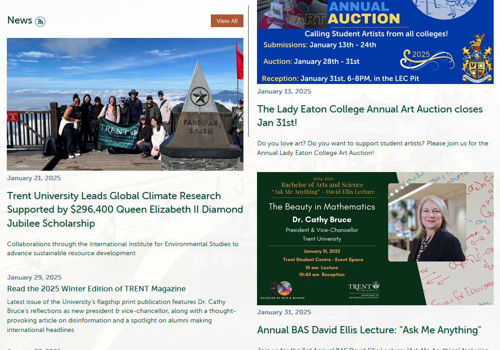

# Workshop 4

By: Jamie Mitchell

## Emphasis

Latest issue of the University’s *flagship* print publication features Dr. Cathy Bruce’s reflections as new president & vice-chancellor, along with a thought-provoking article on disinformation and a spotlight on alumni making _international headlines_

## Strong

Strategic merging of former departments of Centre for **Teaching** and __Learning__ and Trent Online will offer more inclusive, comprehensive resources to support faculty, instructors, and student learning

## Lists

### Unordered Lists

- List Item 1
- List Item 2
    - Sub Item 1
    - Sub Item 2
- List Item 3

### Ordered Lists

1. First Item
2. Seconed Item
    1. First Sub Item
    2. Second Sub Item
3. Third Item


## Images 



## Hyperlinks

[myTrent website](https://my.trentu.ca/portal/)

## Including code

### Inline

in HTML the `` tag is used to display pictures

### Code Fences

```html
<nav>
        <ul>
          <li><a href="index.html">Home</a></li>
          <li><a href="grid.html">Grid</a></li>
          <li><a href="https://trentu.ca">Trent</a></li>
          <li><a href="https://loki.trentu.ca">Loki</a></li>
        </ul>
      </nav>
```

```css
body {
  font-family: system-ui, -apple-system, BlinkMacSystemFont, "Segoe UI", Roboto,
    Oxygen, Ubuntu, Cantarell, "Open Sans", "Helvetica Neue", sans-serif;
  height: 100vh;
  display: flex;
  flex-direction: column;
}
```
